# Hi there 👋 I'm Ramazan Huseynov (Raemishex)

<picture>
  <source media="(prefers-color-scheme: dark)" srcset="dark.svg">
  <source media="(prefers-color-scheme: light)" srcset="light.svg">
  
</picture>

---

## 🚀 About Me
I'm a **Full-Stack Developer**, **QA Automation Specialist**, and **AI Workflows & Security Analyst**. I build autonomous AI swarms, secure IoT infrastructure, and craft interactive modern web experiences using Vibe Coding.

- 🌍 Based in **Baku, Azerbaijan**
- ✉️ Contact me: **huseyinovr686@gmail.com**
- 🛡️ Focus: Blue Team Threat Hunting, Network Intrusion Detection, and AI Agent Systems.

---

## 🛠️ Tech Stack & Tools
* **Frontend:** React, Next.js, HTML5, CSS3, Tailwind CSS, Three.js (WebGL)
* **Backend & Systems:** Node.js, C# ASP.NET Core, Python, SQL Databases, Docker
* **AI & Agentic Frameworks:** Claude Code, Gemini CLI, Autogen, MCP Servers, Graphify
* **Cybersecurity:** Seneca Cybench, blue-team forensics, SIEM log analysis

---

## 📈 GitHub Stats

  
  

---

## 🤝 Connect with Me

  
  
  

